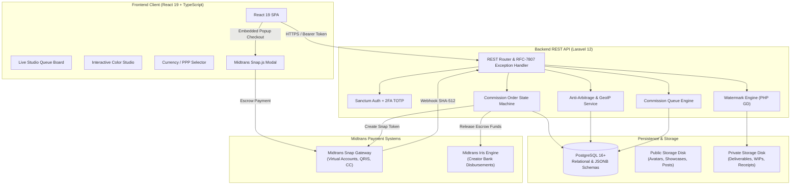
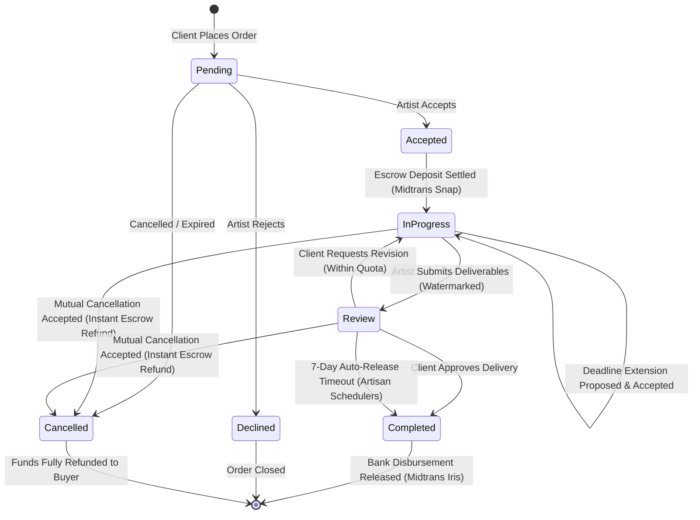

# Comme Platform — Architecture & Security Specification

This document provides a comprehensive technical guide to the architectural design, security mechanisms, state machines, and core algorithms implemented across the **Comme** digital creator marketplace platform.

---

## 1. System Overview & High-Level Architecture

Comme is organized as an enterprise-grade full-stack monorepo consisting of:
1. **Backend Engine (`backend/comme-backend`)**: Laravel 12 REST API handling business logic, authentication, escrow processing, anti-arbitrage validation, watermarking, and scheduled automations.
2. **Frontend Client (`frontend/comme-frontend`)**: React 19 Single-Page Application (SPA) powered by Vite, TailwindCSS, Framer Motion, and Lucide icons.
3. **Database & Cache Layer**: PostgreSQL 16+ serving relational data, JSONB regional price schemas, and queue job tables.
4. **Third-Party Gateways**: Midtrans Snap for client escrow deposits and Midtrans Iris for automated creator bank disbursements.

---

## 2. Commission Escrow Lifecycle & State Machine

The platform enforces a strict, idempotent state machine governing order progression, client protection, and financial disbursements.

### Financial Flow & Escrow Protection
1. **Deposit**: Upon order placement, funds are held in escrow via Midtrans Snap. Funds are not credited to the artist until work is approved.
2. **Platform Fee**: A standard 5% platform fee is deducted upon settlement, with the remaining 95% credited to creator net earnings.
3. **Mutual Cancellation & Instant Refund**: If either party initiates cancellation and both agree (or for unaccepted paid orders), the backend triggers the Midtrans Direct Refund API, reversing the transaction immediately.
4. **Auto-Release Safety Timeout**: If an artist delivers completed artwork and the client becomes inactive without confirming or requesting revisions, `php artisan commissions:release-due-payouts` scans the database every minute and automatically completes orders after 7 days, releasing creator earnings safely.

---

## 3. Purchasing Power Parity (PPP) & Anti-Arbitrage Engine

To accommodate global creators and buyers across varying economic regions, Comme incorporates a comprehensive Purchasing Power Parity system.

### GeoIP & Country Resolution (`GeoIpService`)
The backend identifies user geographic origin using a layered resolution strategy:
1. `CF-Connecting-IP` (Cloudflare edge headers).
2. `X-Forwarded-For` (reverse proxies and load balancers).
3. MaxMind GeoLite2 country database lookup.

### Regional Price Schemas
Commission options and addons feature flexible pricing models:
- **`pricing_mode = 'fixed'`**: Static global price in base currency.
- **`pricing_mode = 'ppp_multiplier'`**: Dynamically scales the base price according to regional purchasing power factors.
- **`regional_prices` JSONB**: Direct overrides mapping ISO country codes (e.g. `ID`, `US`, `JP`, `EU`) to custom localized prices.

### Anti-Arbitrage Fraud Mitigation (`AntiArbitrageService`)
To prevent buyers from manipulating regional tiers using VPNs or spoofed parameters:
- **Server-Side Validation**: Checks that transaction currency matches the validated regional tier for the buyer's payment profile.
- **Payment Method Verification**: Enforces that billing payment methods (e.g. Indonesian VA, domestic QRIS, international cards) align with the selected regional pricing tier before issuing Midtrans Snap tokens.

---

## 4. Automated Diagonal Watermark Security Engine (`WatermarkService`)

To safeguard digital illustrators against unauthorized image extraction, screen-grabbing, and prompt injection prior to final approval, Comme implements an automated image protection pipeline powered by the PHP GD extension.

### Watermark Algorithm & Geometry
- **Text Signature**: Renders diagonal repetitive lines combining:
  `{Artist_Username} • {Commission_Code} • COMME STUDIO VERIFIED`
- **Dynamic Orientation**: Tiled at a 35-degree diagonal angle across the entire image dimensions.
- **Alpha Blending**: Configurable semi-transparency (28%–35% alpha) ensuring client reviewers can inspect artistic detail and anatomy while rendering the preview useless for unauthorized commercial distribution.
- **Access Isolation**:
  - **Review Deliverables**: Served through watermarked proxy routes (`/api/commissions/{id}/preview-watermarked`).
  - **Final Originals**: Stored strictly on the protected private disk and unlocked via single-use signed download links only after `completed` status is confirmed.

---

## 5. Live Studio Commission Queue Engine

Inspired by Japanese creator workflow standards (Skeb) and modern commission studios (VGen), Comme features a real-time live studio queue board.

### Architectural Features (`CommissionQueueController`)
- **Capacity Caps**: Artists configure maximum concurrent order limits (e.g., 5 active slots).
- **Slot Allocation**: Orders in `accepted`, `in_progress`, and `review` occupy active slots.
- **Anonymous Tracking**: Public viewers see slot numbers (`Slot #1`, `Slot #2`), anonymized codes (`COM-#5`), tier names, and stage pills (`In Production`, `Under Review`).
- **Client Queue Spotlight**: Authenticated buyers viewing an artist's queue board receive an automated spotlight banner highlighting their active position and direct link into their order workspace.

---

## 6. Security Architecture & Hardening

| Layer | Implementation | Security Benefit |
|---|---|---|
| **API Authentication** | Laravel Sanctum Bearer Tokens | Decoupled cross-origin authentication resilient to CSRF in mobile and SPA contexts. |
| **Two-Factor Auth** | RFC-6238 TOTP with QR Setup | Mitigates credential-stuffing attacks with encrypted emergency recovery codes. |
| **Data Encryption** | AES-256 via Laravel Encryption | Artist bank accounts and payout coordinates are encrypted at rest and masked (`••••••••1234`) in API output. |
| **CORS Policy** | Strict `CORS_ALLOWED_ORIGINS` | Explicit domain allowlisting rejecting arbitrary cross-origin script execution. |
| **Error Handling** | RFC-7807 Problem Details | Unified error envelopes avoiding stack trace leaks while supplying structured debug IDs. |
| **Observability** | `X-Request-ID` Tracing + Pulse APM | Request correlation IDs injected across client headers, logs, and database listeners. |
| **Rate Limiting** | Role-Tiered Limiting | Throttles guest, buyer, artist, and administrative actions to prevent scraping and brute force. |

---

## 7. Media Storage & Multi-Disk Architecture

Comme utilizes a dual-disk architecture separating public assets from protected deliverables:
- **`public` Disk (`storage/app/public`)**: Public social posts, user avatars, studio banners, and public portfolio items.
- **`private` Disk (`storage/app/private`)**: High-resolution commission deliverables, private brief attachments, and purchase receipts. Access is strictly gated via `PrivateMediaController` with policy authorization.
- **Asynchronous Background Optimization (`ProcessMediaJob`)**: Image thumbnails and MP4 video faststart relocations are offloaded to background database queues with automatic retries and transaction isolation (`after_commit = true`).
- **Automated Orphan Pruning (`php artisan media:prune`)**: Daily scheduled job sweeps abandoned temporary uploads older than 24 hours to prevent storage bloat.

---

## 8. Client Design Tokens & Custom Color Studio

The frontend design system is built around a modern glassmorphic canvas with neutral slate grey surfaces and a single customizable primary brand token:
- **Token Consistency**: All borders, secondary surfaces, and inactive tabs use unified neutral slate tones (`--secondary`, `--muted`, `--accent`, `--border`) to prevent clashing color mixtures.
- **Custom Color Studio**: Available in **Settings > Appearance**, allowing users to fine-tune the primary brand highlight using an interactive 2D HSV canvas, hue slider, and direct hex input.
- **Accessibility & Contrast**: Includes automatic luminance calculations (`getContrastForeground`) ensuring text readability on top of custom primary accents.
