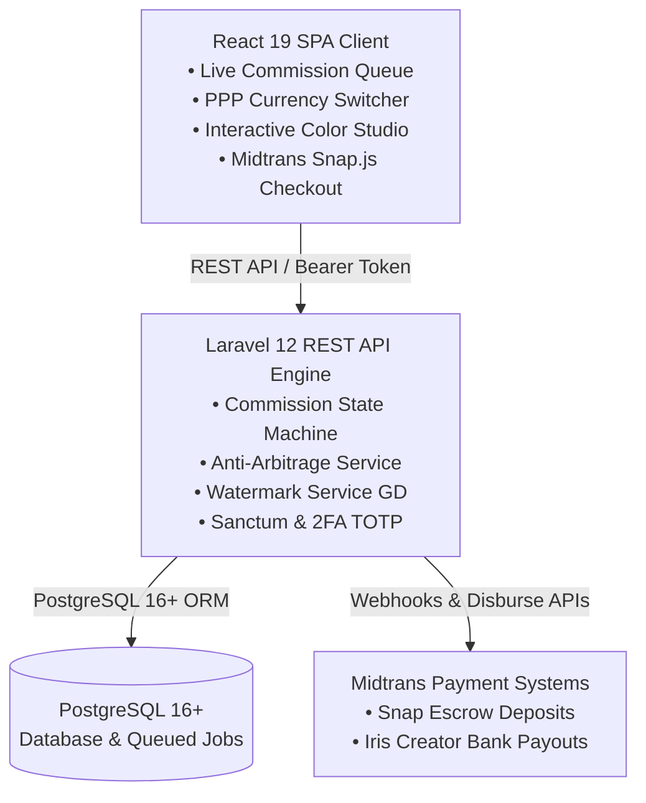

# Comme Platform Documentation

Welcome to the **Comme** technical documentation directory. This directory contains architectural guides, security specifications, workflow diagrams, and integration manuals for the Comme creator marketplace.

---

## Documentation Index

| Document | Description |
|---|---|
| **[Architecture & Security Guide](ARCHITECTURE.md)** | In-depth breakdown of the system architecture, escrow state machine, Anti-Arbitrage PPP engine, Watermarking pipeline, and multi-disk file system. |
| **[Backend Technical Guide](../backend/comme-backend/README.md)** | Laravel 12 REST API setup, endpoint reference catalog, Artisan background schedulers, and PHPUnit test suite. |
| **[Frontend Technical Guide](../frontend/comme-frontend/README.md)** | React 19 Client SPA setup, design token system, live Studio Queue Board, Color Studio, and component organization. |
| **[Interactive API Explorer](http://localhost:8000/explore)** | In-browser API testing console with token persistence and latency measurement (available when backend server is running). |
| **[Interactive Log Viewer](http://localhost:8000/log-viewer)** | In-browser real-time log inspector with stack trace visualization (available when backend server is running). |
| **[Transactional Email Inspector](http://localhost:8000/emails)** | Live preview for transactional mailers with viewport switching and plaintext validation (available when backend server is running). |

---

## Brand Assets & Media

- **[Logos & Wordmarks](Images/Comme_Wordmark.svg)**: Vector SVG wordmark and brand graphics.
- **[Platform Icons](Icons/)**: App icons in resolutions ranging from `32x32` to `512x512` PNGs and vector SVGs.

---

## Core System Highlights

For detailed architectural specifications, please refer to **[ARCHITECTURE.md](ARCHITECTURE.md)**.
